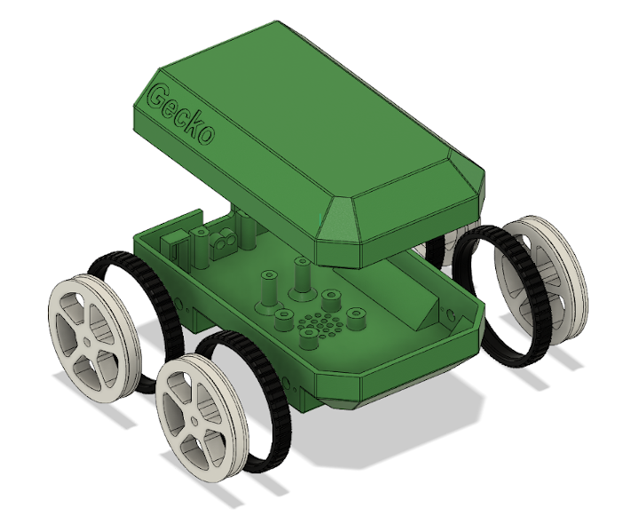

# Gecko

Gecko is a small Arduino Mini based 4 wheel rover. It is designed for BLE 
control utilizing the TrailBlazer iOS app although any iOS or Arduino 
Bluetooth rover control app would work with different on-board controller 
software. This bot does not include a sensor suite as it is intended to be 
a relatively simple starter project for building and understanding a BLE 
controlled bot.

Gecko will run well on tile or wood floors but may struggle on thicker carpet 
due to the small size and low chassis clearance. Gecko utilizes differential 
steering which creates an additional challenge on carpets or rugs.

Gecko utilizes an AdaFruit USB charging board and 2500mAh LiPo battery so that 
you can recharge and run without opening the chassis or disconnecting any wiring. 
LiPo batteries can be dangerous so please follow all recommended safety precautions
when with working with them.

In this repository you will find the STL files and Gecko on-board Arduino sketch.

## Controller
The [controller sketch](sketch/Controller.md) is a relatively simple motor command
controller that reads input from the HM-10 module on serial input.

## Components
The total cost for the components as built is around $107USD. Gecko can be
built for a lower cost by excluding the PowerBoost 1000 ($24USD) or substituting it with the 
PowerBoost 500 although the prototype does have the 1000 installed.

* [N20 Micro 150RPM 6V DC Motor](https://www.amazon.com/gp/product/B07R52WG9J/)
* [Arduino Pro Mini 5V 16MHz](https://www.amazon.com/HiLetgo-Atmega328P-AU-Development-Microcontroller-Bootloadered/dp/B00E87VWQW/)
* [AdaFruit PowerBoost 1000](https://www.amazon.com/gp/product/B01BMRBTH2)
* [2500 mAh 3.7V Battery](https://www.amazon.com/2500mAh-battery-Rechargeable-Lithium-Connector/dp/B07BTR3BZ4/) 
* [HM-10 BLE Module](https://www.amazon.com/gp/product/B06WGZB2N4)
* [L9110S DC Motor Controller](https://www.amazon.com/gp/product/B00M0F243E/)
* [SPDT 3 Pin Switch](https://www.amazon.com/gp/product/B01N7NCW8N)
* [3mm Green LED](https://www.amazon.com/JABINCO-Circuit-Assorted-Science-Experiment/dp/B0827KYRFH)
* [3mm Red or Yellow LED](https://www.amazon.com/JABINCO-Circuit-Assorted-Science-Experiment/dp/B0827KYRFH)

## Additional Part and Tools
* [Angled Header Pins](https://www.amazon.com/Antrader-2-54mm-Right-Header-Connector/dp/B07M88GRHG)
* [26AWG Wire](https://www.amazon.com/Stranded-Felexible-Insulated-Electronic-ELectrical/dp/B07J3DS831)
* Heat Shrink Tubing
* M1.4x4 Screws
* M2 Screws
* M2.5 Screws
* PLA
* TPU
* Soldering Iron

