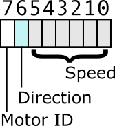

# Controller

The controller for Gecko is a very simple controller for Bluetooth Low Energy 
(BLE) and the L9110S controller 4 motors with 2 left and 2 right. It enables 
you to control the speed and direction of the left and right motors
independently with enough fidelity for smooth accerleration and deceleration. 

There were several requirements that went into controller design.

* I have found that the motors do not respond to the full range of possible values from
0 - 255 although I wanted more control than STOP-SLOW-MED-FAST that some BLE controllers
provide. 

* Gecko uses the HM-10 BLE module which I have found will drop data at any transmission
rate. This may not be common to all HM-10 modules; however, to avoid any code complexity
around error handling I wanted a simple command channel.

* The TrailBlazer iOS App includes a controller designed for single thumb control
for speed and direction that simulates analog joystick like input. The onboard
controller should support this.

These requirements led to a single byte command for motor speed and direction that 
allow relatively fine grained controll of the motors with a command channel that 
responds will to dropped bytes and a continuous stream of command data from the 
remote controller application.

## Motor Command

The motor command for left and right motors is a simple single byte command. 
* bit 7 is the motor ID
* bit 6 is the motor direction 
* bit 5-0 are the motor speed

The controller uses simple bit masks and shift operators to decode the command.

    motor_id = command & 0x80;
    direction = command & 0x40;
    speed = (command & 0x3F) << 2;
 
The parenthesis around (command & 0x3F) are  necessary since the bitwide AND, `&` 
operator has a lower precedence than the bitwise shift left `<<` operator. There are 
references below if you are unfamiliar with the C bitwise operators: 

* [C Operator Precedence](https://en.cppreference.com/w/c/language/operator_precedence)
* [C Bitwise Operators](https://www.programiz.com/c-programming/bitwise-operators)

These bit mask values are replaced with preprocessor defines in the code:

    //-----------------------------------------------------------------------------
    // Command bit masks
    #define INPUT_MASK_MOTOR    0x80
    #define INPUT_MASK_DIR      0x40
    #define INPUT_MASK_SPEED    0x3F

The controller includes a function that sends the commands to the L9110S

    static void motor_command(uint8_t motor_id, uint8_t speed, uint8_t direction) {
     ...
    }

This makes the main loop a simple serial read to get the next byte from the HM-10, 
decode it and send it to the motors. The controller code is simple since each command
is atomic and there is no sequence of bytes that have to be read.

    void loop() {
        // wait for input
        while( !Serial.available() ); 
        input = Serial.read();
        // get the motor ID
        motor_id = (input & INPUT_MASK_MOTOR) == 0 ? MOTOR_LEFT : MOTOR_RIGHT;    
        // get the motor direction
        direction = (input & INPUT_MASK_DIR) == 0 ? DIR_FORWARD : DIR_REVERSE;
        // get the motor speed
        speed = (input & INPUT_MASK_SPEED) << 2;
        motor_command(motor_id, speed, direction);
    }
    
